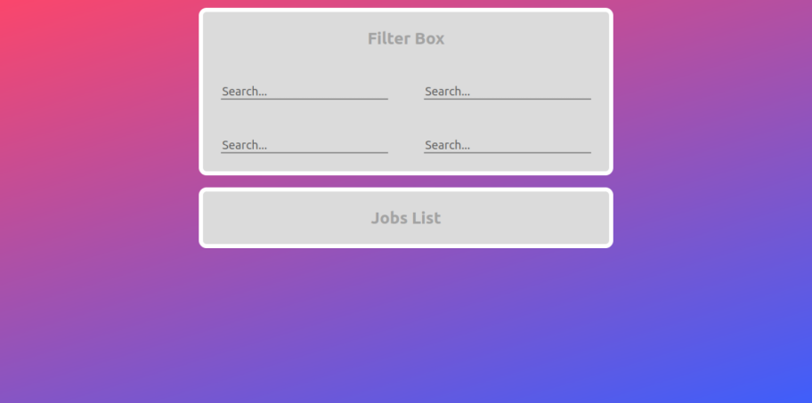

# 100 Days Of Code - Log

### Day 1: Sep 21, 2022

**Today's Progress**: Created app, finished the app logic

**Thoughts:** I started this challenge with the 'Front End Development Libraries Projects' from free-code-camp website (check out the **links to work**). I really struggled with CSS, but i managed to almost finish the whole thing. There is only one small detail that I need to work which requires more "CSS stuffs".

**Link to work:** [Build a Random Quote Machine](https://www.freecodecamp.org/learn/front-end-development-libraries/front-end-development-libraries-projects/build-a-random-quote-machine)

### Day 2: Sep 22, 2022

**Today's Progress**: Finished first project

**Thoughts:** Today I finished the Random quote machine project. It was a good start, but like I said yesterday the CSS part was a struggle.

### Day 3: Sep 23, 2022

**Today's Progress**: Started '25+5 Clock' project

**Thoughts:** I started another project from 'Front End Development Libraries Projects' in free-code-camp website. It's a 25+5 clock (Pomodoro timer). I had some struggles with js but it was no big deal. The other parts (such as CSS and ...) are quite easy. I think tommorrow I can finish this project.

**Link to work:** [Build a 25 + 5 Clock](https://www.freecodecamp.org/learn/front-end-development-libraries/front-end-development-libraries-projects/build-a-25--5-clock)

### Day 4: Sep 24, 2022

**Today's Progress**: Finished '25+5 Clock' project

**Thoughts:** I finished '25+5 Clock' project. Overall it was an easy challenge. and there is a lot you can add to make it a bit more challenging.

### Day 5: Sep 25, 2022

**Today's Progress**: Started a 'job filter' app

**Thoughts:** I found this project (links below) on the web. So far it looks something like this:
 

**Link to work:** [Static job filter](https://github.com/rammyblog/static-job-filter)

### Day 6: Sep 26, 2022

**Today's Progress**: Completed 'filter box UI'

**Thoughts:** As always I had struggles with UI and styling with CSS. But I managed to come up with something simple and easy-to-use.

### Day 7: Sep 27, 2022

**Today's Progress**: Completed 'filter box' handlers

**Thoughts:** Today I wrote handlers for filter-box inputs. Filter-box is finished and tomorrow I'll work on job-list-box.

### Day 8: Sep 28, 2022

**Today's Progress**: Completed 'job-list box UI'

**Thoughts:** As usual... some struggles with CSS. I hope that I can finish this project by tomorrow.

### Day 9: Sep 29, 2022

**Today's Progress**: Completed 'job-list rendering based on filter'

**Thoughts:** I finished the 'job filter app' project. The implemention of filtering the data was a bit confusing but finally I did it and finished the project.
